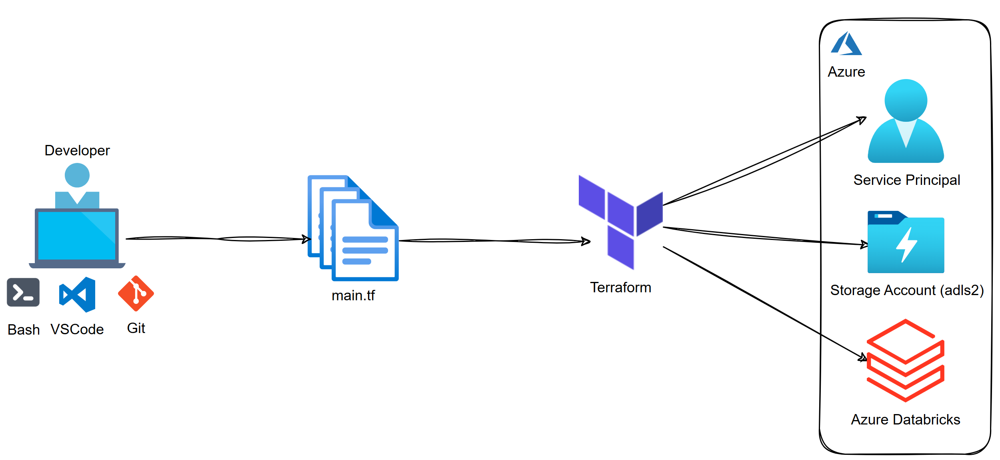
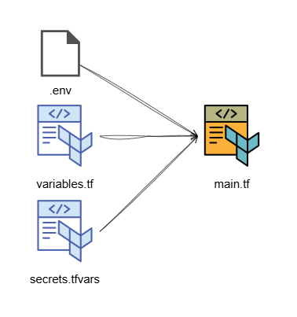

Creation Date: 2024-10-29

Tags: #devops #dataengineering

Related to: [[DevOps]]
___
--- 

<br> <!-- Break between lines -->

# About
This project was inspired by curiosity and the recognition that, as a data engineer, it’s increasingly important to have foundational knowledge of DevOps practices like Terraform, often referred to as “Infrastructure as Code” (IaC). This approach is essential for modern, automated infrastructure management.

Special thanks to Pedro Junqueira ([Pytalista](https://youtu.be/8A0uZ0BoJ9k?si=1Bsm0MekZWnMOKh_)) for his insightful YouTube tutorial, which served as a valuable guide and inspiration for developing this project.

This project contains a deployment of the following Azure resources using Terraform:

- **Service Principal (`tf-sp`)**: Based on HashiCorp's documentation, _"We recommend using either a Service Principal or Managed Service Identity when running Terraform non-interactively (such as when running Terraform in a CI server) - and authenticating using the Azure CLI when running Terraform locally."_ For more details, refer to this link: [Service Principal Documentation](https://registry.terraform.io/providers/hashicorp/azurerm/latest/docs/guides/service_principal_client_secret).
    
- **Resource Group (`terraform-rg`)**: A container that holds related resources (e.g., Azure Data Factory, Web Apps, Databricks, VMs) for an Azure solution.
    
- **Storage Account (`labaigoadlsauc1`)**: A unique namespace for your data storage that is accessible from anywhere, such as Azure Databricks.

<br> <!-- Break between lines -->

# Diagrams
## High-level


## Terraform Level

- `.env`: Used to store environment-specific configuration details for your Azure service principal:
```text
ARM_SUBSCRIPTION_ID=<subscription id>
ARM_CLIENT_ID=<appId value>
ARM_CLIENT_SECRET=<password value>
ARM_TENANT_ID=<tenant value>
ARM_SERVICE_PRINCIPAL_NAME=tf-sp

# It provides a convenient way to manage environment variables, especially for sensitive information like Azure service principal credentials.

# Before running Terraform commands, ensure these variables are initialized (see step 4.1).
```
- `variables.tf`: We define the subscription_id variable here, which is used in `main.tf`.
- `secrets.tf`: Contains a placeholder for your Azure subscription ID. As a best practice, this file should be excluded from version control (e.g., added to `.gitignore`) to protect sensitive information. In this example, I’ve included it for demonstration, but no actual Azure subscription information is provided.

When running Terraform commands, we specify the `-var-file option`:
```bash
terraform plan -var-file="secrets.tfvars" 
terraform apply -auto-approve -var-file="secrets.tfvars" 
terraform destroy -auto-approve -var-file="secrets.tfvars"
```

Explanation:

- `-var-file="secrets.tfvars"`: This tells Terraform to load variable values from the specified file. It's how you provide the actual subscription ID value to Terraform.
- `-auto-approve`: This flag skips interactive approval of the plan. Use with caution, especially for `apply` and `destroy` operations.

<br> <!-- Break between lines -->

# Pre-requisites
1. **WSL Ubuntu** (Windows Subsystem for Linux) installed on your system.
	- [Installation Tutorial](https://www.youtube.com/watch?v=HrAsmXy1-78)
2. **Azure subscription**
	- [Azure Free Account](https://azure.microsoft.com/en-us/pricing/purchase-options/azure-account?icid=azurefreeaccount)
3. **Visual Studio Code** (VS Code) installed.
	- [Download VS Code](https://code.visualstudio.com/download)
4. **Azure CLI** installed on your WSL Ubuntu instance.
	- **Option 1:** Install with one command (this is what I used): 
		- `curl -sL https://aka.ms/InstallAzureCLIDeb | sudo bash`
	- **Option 2:** Follow step-by-step instructions
	- [Install Azure CLI on Linux](https://learn.microsoft.com/en-us/cli/azure/install-azure-cli-linux?pivots=apt)
	- Validate installation by running: `az version`.
5. **Terraform CLI** installed on your WSL Ubuntu instance.
	- Make sure to use your WSL Ubuntu terminal for this installation.
	- Reference: [Terraform Installation Guide](https://developer.hashicorp.com/terraform/install)
	- You can also refer to this: [HCP Linux installation](https://developer.hashicorp.com/terraform/install)

After you have installed all the prerequisites, create your project repository. You can decide where and how to organise your project folders.

For example, you might create a folder structure like this: 
`C:\deta-enjinia\terraform-projects`

<br> <!-- Break between lines -->

# Simplified Steps
In this section, you’ll find simplified steps to guide you from logging into Azure to creating a service principal and Azure storage account.

## Terraform Key commands (in order):

```bash
terraform init
```

```bash
terraform validate
```

```bash
terraform plan -var-file="secrets.tfvars"
```

```bash
terraform apply -auto-approve -var-file="secrets.tfvars"
```

```bash
terraform destroy -auto-approve -var-file="secrets.tfvars"
```

**Tip:** After finishing your `main.tf` script, you can format it using the command below:
```bash
terraform fmt
```

### 1. Login to your Azure account
```bash
az login
```

### 2. Set the subscription you want to use. This command will only need to be run once per session
```bash
DEFAULT_SUBSCRIPTION_ID=$(az account show --query id --output tsv)
az account set --subscription $DEFAULT_SUBSCRIPTION_ID
```

### 3. Create the service principal. You can use any name you prefer; in this example, we’ll name it `tf-sp`
**Note:** This step is only needed once, unless you need to update .env with new values (see step 4 for security considerations).
```bash
az ad sp create-for-rbac --name tf-sp --role Contributor --scopes /subscriptions/$DEFAULT_SUBSCRIPTION_ID
```

### 4. Create a file .env with the variables below
```bash
ARM_SUBSCRIPTION_ID=<subscription id>
ARM_CLIENT_ID=<appId value>
ARM_CLIENT_SECRET=<password value>
ARM_TENANT_ID=<tenant value>
ARM_SERVICE_PRINCIPAL_NAME=tf-sp
```
### 4.1 Initialise the .env file
```bash
source .env
```

### 4.2 Test if these variables have been initialised successfully
```bash
echo $ARM_SERVICE_PRINCIPAL_NAME
```

### 5. Create Terraform files
#### 5.1. Create variables.tf and define the `subscription_id` variable.
```terraform
variable "subscription_id" {
  description = "The Azure subscription ID"
  type        = string
  sensitive   = true
}
```

#### 5.2. Create a Terraform file, which we’ll call `main.tf` in this example. 
This file will serve as the main module for building your infrastructure. For syntax guidance, refer to the examples in the provided GitHub repository.

#### 5.3. Create `secrets.tfvars` to store your `subscription_id` value.
In the `secrets.tfvars` file, store the actual value for `subscription_id`. 
**Important:** This file should not be included in version control (e.g. add secrets.tfvars to your `.gitignore` file):

```terraform
subscription_id = "your-actual-subscription-id"
```

The `secrets.tfvars` file provides a secure way to supply sensitive values separately from your main Terraform files.
### 6. Initialise the working directory by running the command below.
```bash
terraform init
```

### 7. Validate your configuration:
```bash
terraform validate
```
### 8. Run `terraform plan` to validate your configuration file. This command checks for syntax errors and displays the resources that will be created.
```bash
terraform plan -var-file="secrets.tfvars"
```

Using `-var-file="secrets.tfvars"` loads the `subscription_id` value without exposing it directly in your main configuration files.

**Important**: Starting from version 4.0, specifying the subscription ID in the provider section is mandatory. Refer to this link: https://registry.terraform.io/providers/hashicorp/azurerm/latest/docs/guides/4.0-upgrade-guide#specifying-subscription-id-is-now-mandatory

### 9. Execute the actions proposed in a Terraform plan

#### 9.1 Run `terraform apply` to build or modify your infrastructure deployment. You’ll be prompted to confirm the actions by typing `yes`

#### 9.2 If you prefer to skip the confirmation prompt, you can use the following command:
```bash
terraform apply -auto-approve -var-file="secrets.tfvars"
```

### 10. To delete the resources you created (e.g., `terraform-rg` and `labaigoadlsauc1`), run the following command:
```bash
terraform destroy -auto-approve -var-file="secrets.tfvars"
```